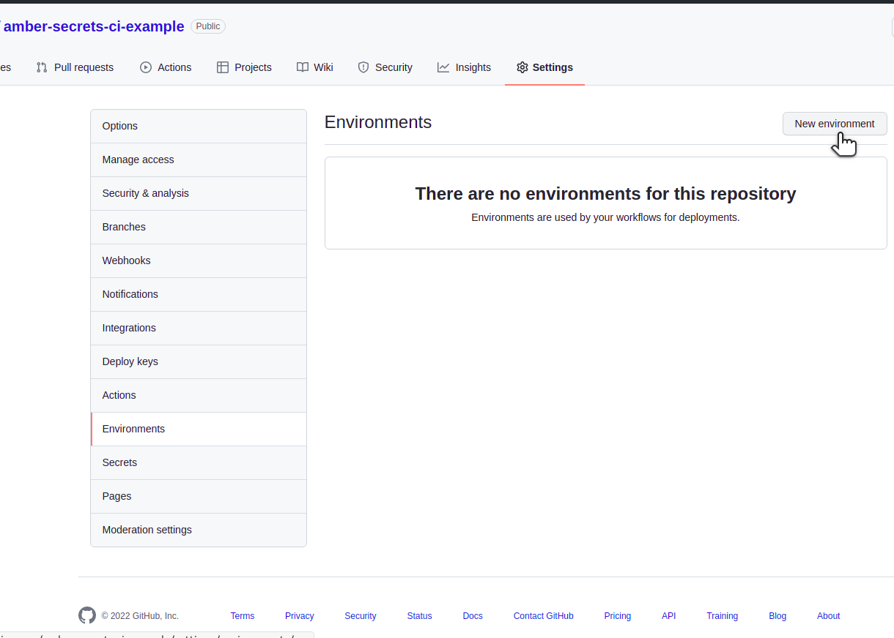
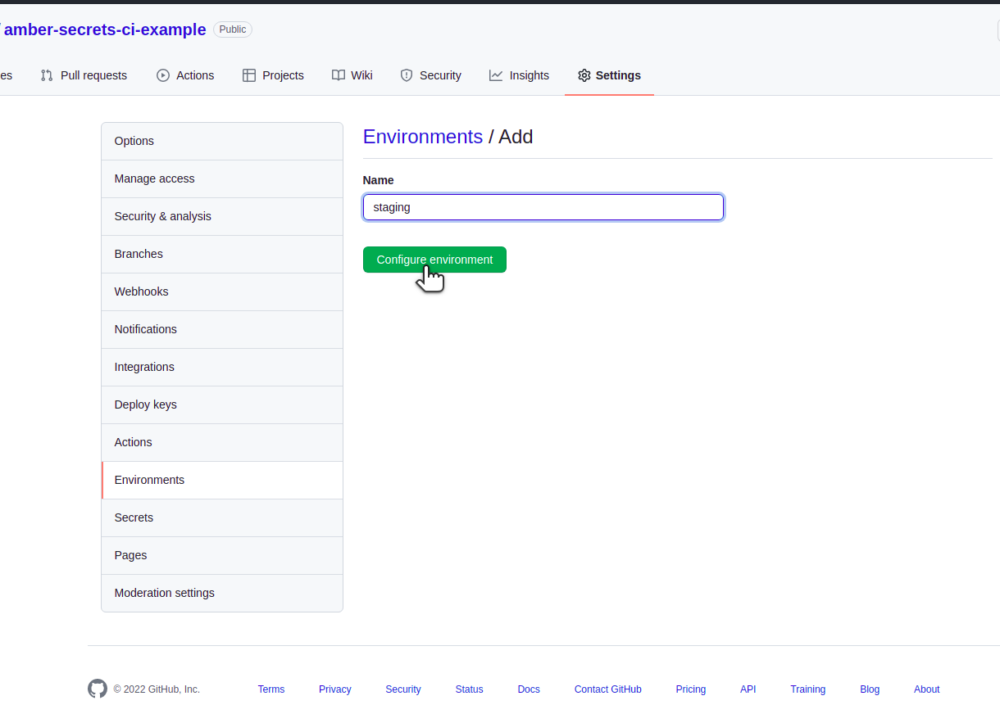
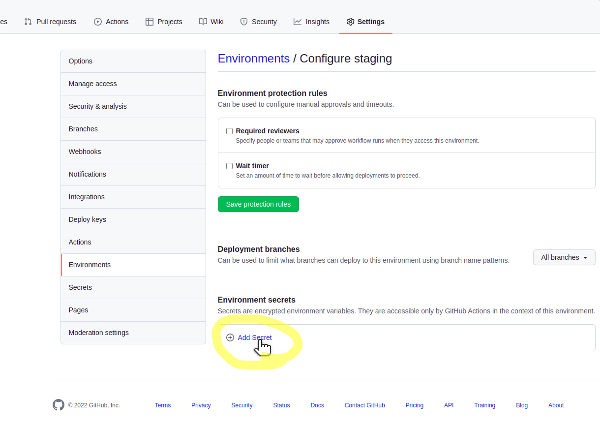
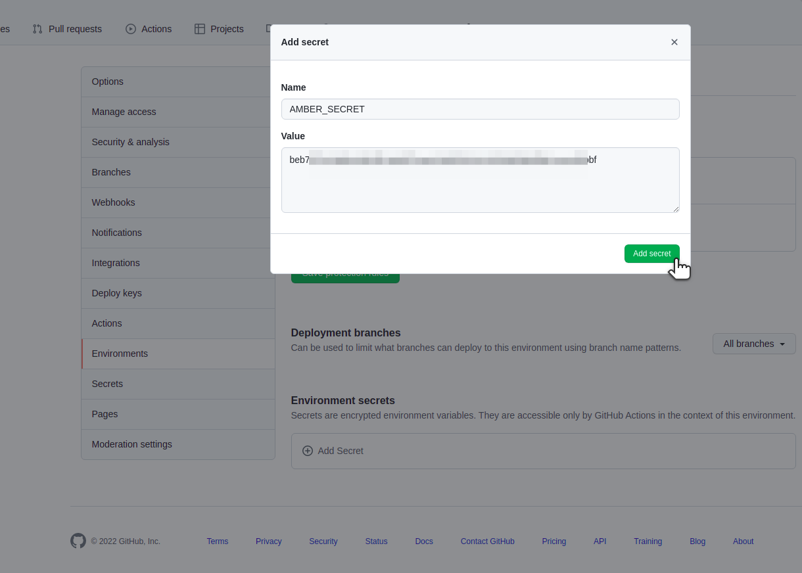
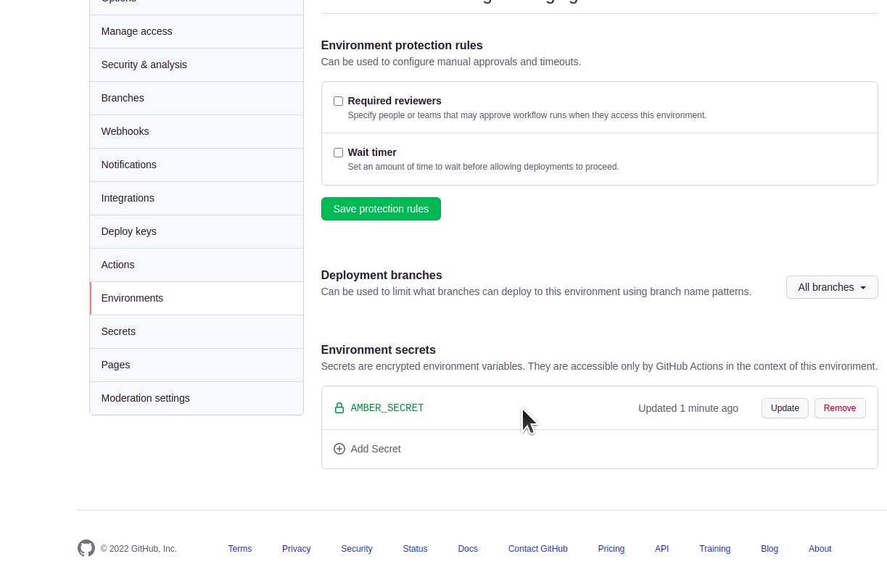

# Open Source CI/CD Secrets Management with Amber

Normally in GitHub/Gitlab and other, you have to create an entry for every secret, per environment,
and keep updating these. This does not scale.

- Better tools. Better productivity


### Praise / ah-ha! moments 💡

> "Damn, I forgot to update the CI/CD secrets and my build is failing."

With amber your secrets are version controlled alongside your code.

> "Help! I'm debugging my pipeline, I wish I could securly decrypt my CI/CD secrets to troubleshoot my issue."

With amber you can securly decrypt your secrets.

> "That would be useful for updating and maintaining the secrets because it gets confusing with so many secrets."

Every CI/CD system has a different interface, amber reduces the compexity with [only one](https://xkcd.com/927/) place to manage such secrets.


## tldr: How do I store secrets using amber for different environments?

1. Init `amber` one-time and put the secret key somewhere safe 🔐
  ```
  amber init --amber-yaml amber-staging.yaml
  ```

2. Store a secret
  ```
  amber --amber-yaml amber-staging.yaml encrypt API_KEY api-key-secret-for-staging-environment
  ```
3. Print all secrets
  ```
  export AMBER_SECRET=<secret-key>
  amber print --amber-yaml amber-staging.yaml
  export API_KEY="api-key-secret-for-staging-environment"
  ```
4. Use secret in a command: (output is automatically hidden from `stdout`)
  ```
  amber exec --amber-yaml amber-staging.yaml -- sh -c 'echo $API_KEY'
  ******
  # Proof
  amber exec --amber-yaml amber-staging.yaml -- sh -c 'echo $API_KEY > out.txt'
  cat out.txt
  api-key-secret-for-staging-environment
  ```

## Details - Why is this better?

You could use your CI/CD's secrets apis (if it exists), but there's a better
way.

With amber, you only need to store **one** secret per environment, *and* they're
version tracked.

Another bonus is that it's the same process regardless of which CI/CD pipeline tool your using
(GitHub, GitLab, concourse ci, Jenkins) it's the same pattern, reducing lock-in to your CI/CD system.

Finally, since secrets are securly stored in the repo, they are versioned. 

## Setup

### Install amber

[See amber instructions for your os](https://github.com/fpco/amber#install).

If on x86_64 linux:

```
curl -L https://github.com/fpco/amber/releases/download/v0.1.1/amber-x86_64-unknown-linux-musl > amber
chmod +x amber
sudo mv amber /usr/local/sbin/
```

### Generate staging secret key (aka `AMBER_SECRET`)

Use the `amber` cli to create a secret key and yaml file for each environment.

e.g. here we create a staging and production file:

> Remember to store your secret key elsewhere for each environment, since you'll never be shown it again. Recommendation: keep it in a password manager.

#### Create amber-staging.yaml

```
amber init --amber-yaml amber-staging.yaml
```

After running the above command, `amber` will create a file `amber-staging.yaml` for you, and
generate a `secret key` which can be used to decrypt the file contents.


**Important**: Copy the secret key to you password manager.

#### Create amber-production.yaml

```
amber init --amber-yaml amber-production.yaml
```

**Important again**: Copy the secret key for production to you password manager.


### Commit `amber-staging.yaml` and `amber-production.yaml`

Commit `amber-staging.yaml` and `amber-production.yaml` to your repo.

e.g.
```
git add amber-staging.yaml amber-production.yaml
git commit -m 'added amber-staging.yaml and amber-production.yaml'
```


## Creating secrets

Now you have created `amber-staging.yaml` and `amber-production.yaml` you can create and
securly store secrets per environment.

In this example, we'll create a secret called `API_KEY`, which has a different
value for staging than production, so we'll use `amber` to create the `API_KEY`
for each environment.

### Create `API_KEY` for staging environment

```
amber --amber-yaml amber-staging.yaml encrypt API_KEY api-key-secret-for-staging-environment
```

The above asks `amber` to encrypt and store the secret key `API_KEY` with the value `api-key-secret-for-staging-environment`
in your `amber-staging.yaml` file.

Before adding secret:
```
(base) (main)$ cat amber-staging.yaml 
---
file_format_version: 1
public_key: faeb750df2e702c8e525d2738b528d53ed646f5ca9b6552bbc17025a27630706
secrets: []
```

After adding secret:
```
(base) (main)$ cat amber-staging.yaml 
---
file_format_version: 1
public_key: faeb750df2e702c8e525d2738b528d53ed646f5ca9b6552bbc17025a27630706
secrets:
  - name: API_KEY
    sha256: 166a83a8722764ad600d7663fea47f43002e988bb1d2a692c1ad2e5a5c04637a
    cipher: 7d23a1ccedef3f528c69d3cb9734afe6e77640c2736fa668b30e50f204e1d02cd6b81050b0e9e42f8288f076c52220a0027d31e3e5a50e4675106c60e5e2b670bd0dc382264b367d8c6f5c5af2c7f8e7650421e6eb42
```


### Create `API_KEY` for production environment

> **Important** remember to `export` the AMBER_SECRET for the environment your working with
  otherwise, secrets will be encrypted with a different secret key to what you're expecting.
  It's no less secure, only confusing and you'll see errors when decrypting like:
  ```
  Error: Error loading secret key from environment variable AMBER_SECRET

  Caused by:
      Secret key does not match config file's public key
  ```

```
# export the production AMBER_SECRET
export AMBER_SECRET=<secret-key-production>
amber --amber-yaml amber-production.yaml encrypt API_KEY api-key-secret-for-production-environment
```

Verify by printing the secret
```
amber print --amber-yaml amber-production.yaml 
export API_KEY="api-key-secret-for-production-environment"
```

### Set up environments (Github CI/CD)


## Detailed step-by-step how to create environments & add secrets in GitHub
<details>
  <summary>
  Detailed Github CI steps with images
  </summary>

  

  Crate staging environment
  

  Add secret
  


  Add the `AMBER_SECRET` you generated from the `amber` cli
  

  Verify `AMBER_SECRET` secret saved to environment.
  

  ## References

  [FP Complete Reduces Your Time To Market With Advanced Software Engineering
  ](https://www.youtube.com/watch?v=1G3FYZEM18U)
</details>

# Errors

```
Error: Error loading secret key from environment variable AMBER_SECRET

Caused by:
    Secret key does not match config file's public key
```

Did you mistakenly encrypt a value with the wrong secret key (e.g. encrypt a production
secret using your staging key?) `export` your other secret and `amber print` to check.
